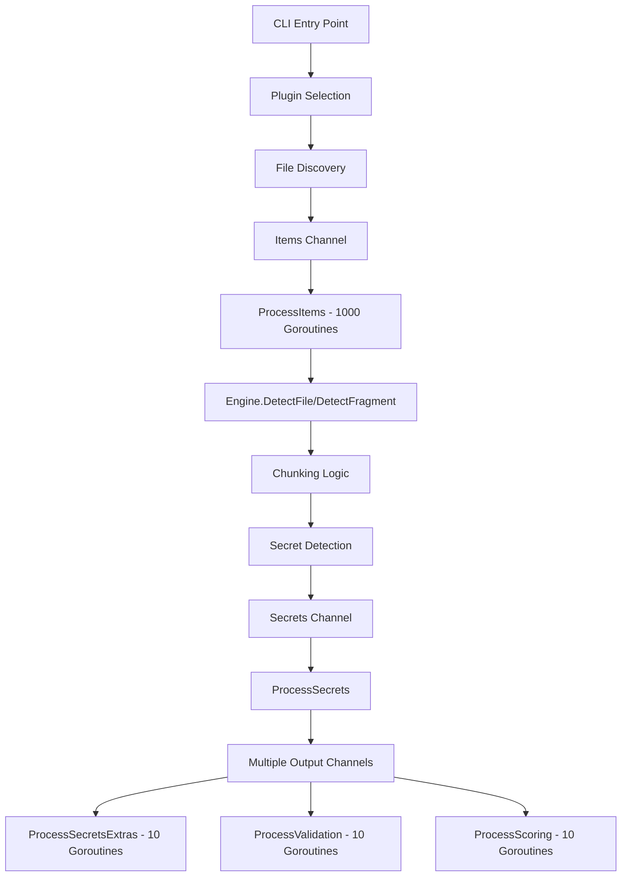

# 2ms Architecture Analysis: Current State and Optimization Proposal

## Executive Summary

The current 2ms codebase suffers from significant architectural inefficiencies, particularly around concurrency management and data flow. The system overuses goroutines without proper coordination, leading to resource contention and poor performance characteristics. This analysis identifies key issues and proposes a refactored pipeline architecture.

## Current Architecture Analysis

### Overall Flow



### Key Components

#### 1. Plugin System
- **Location**: `plugins/`
- **Purpose**: Discovers and yields source items (files, API responses, etc.)
- **Current Issues**:
  - Filesystem plugin uses an errgroup with a limit of 1000 goroutines for item collection, which is inefficient.
  - No backpressure control between discovery and processing
  - Memory inefficient item representation

#### 2. Engine
- **Location**: `engine/engine.go`
- **Purpose**: Core detection logic
- **Current Issues**:
  - Complex semaphore-based memory management
  - Chunking strategy not optimally aligned with detection patterns
  - File vs fragment detection paths are inconsistent

#### 3. Workers
- **Location**: `cmd/workers.go`
- **Purpose**: Coordinate processing pipeline
- **Current Issues**:
  - Excessive goroutine spawning (1000 for items, 10 each for other phases)
  - Complex channel orchestration
  - No proper error handling aggregation

#### 4. Chunking
- **Location**: `engine/chunk/chunk.go`
- **Purpose**: Process large files in chunks
- **Current Issues**:
  - Fixed chunk sizes may not align with secret boundaries
  - Complex pooling strategy with unclear benefits
  - Memory management mixed with processing logic

## Identified Inefficiencies

### 1. Goroutine Overuse
```go
// In ProcessItems - spawns up to 1000 goroutines
g.SetLimit(1000)
for item := range Channels.Items {
    g.Go(func() error {
        return engineInstance.DetectFile(ctx, item, SecretsChan)
    })
}

// In FileSystemPlugin - spawns another 1000 goroutines
g := errgroup.Group{}
g.SetLimit(1000)
for _, filePath := range fileList {
    g.Go(func() error {
        // Just creates an item struct!
        actualFile := p.getItem(filePath)
        // ...
    })
}
```

**Problems**:
- Context switching overhead with a potential of 2000+ goroutines for two different tasks.
- The task in the FileSystemPlugin is very lightweight (creating a struct), making the high goroutine limit particularly wasteful due to scheduling overhead.
- Memory overhead (each goroutine uses ~2KB stack).
- No coordination between plugin discovery and engine processing.
- Resource contention without clear benefits.

### 2. Complex Channel Management
```go
var SecretsChan = make(chan *secrets.Secret)
var SecretsExtrasChan = make(chan *secrets.Secret)
var ValidationChan = make(chan *secrets.Secret)
var CvssScoreWithoutValidationChan = make(chan *secrets.Secret)
```

**Problems**:
- Multiple channels for what should be a single pipeline
- Fan-out complexity without clear separation of concerns
- Difficult to reason about data flow and debug issues
- No backpressure control between stages

### 3. Inefficient Memory Management
```go
// Semaphore-based memory budgeting
weight := int64(e.chunk.GetSize()*4 + e.chunk.GetMaxPeekSize()*2)
err = e.semaphore.AcquireMemoryWeight(ctx, weight)
```

**Problems**:
- Complex semaphore logic for memory management
- Multiple pooling strategies (chunk pools, buffer pools)
- Memory calculations spread across multiple components
- Not aligned with actual memory usage patterns

### 4. Poor Error Handling
```go
func ProcessItems(engineInstance engine.IEngine, pluginName string) {
    // ...
    if err := g.Wait(); err != nil {
        Channels.Errors <- err  // Single error channel for all errors
    }
}
```

**Problems**:
- Single error channel for all processing stages
- Errors from different phases mixed together
- No error recovery or retry mechanisms
- Difficult to trace error sources

## Proposed Refactoring: An Incremental Approach

The full-scale pipeline redesign described previously provides a long-term vision. However, a more practical, incremental approach will deliver value faster and with less risk. The following plan, detailed in `refactoring-plan.md`, will be followed.

### Core Principles

1.  **Incremental Changes**: Replace one component at a time.
2.  **Immediate Value**: Each change should improve performance or maintainability.
3.  **Minimal Disruption**: Keep interfaces stable where possible.
4.  **Focused PRs**: Each Pull Request will target a single, well-defined inefficiency.

### The Incremental Plan Summary

1.  **PR 1: Create Worker Pool Infrastructure**:
    - **Goal**: Build a reusable worker pool that can be used throughout the application.
    - **Solution**: Create `internal/workerpool` with a flexible, configurable worker pool implementation.

2.  **PR 2: Optimize ProcessItems with Worker Pool (Plugin-Agnostic)**:
    - **Problem**: `ProcessItems` uses an `errgroup` with a limit of 1000 goroutines for processing items from ANY plugin.
    - **Solution**: Use a single worker pool in `ProcessItems` that efficiently processes items regardless of which plugin generated them (filesystem, confluence, discord, slack, etc.).
    - **Impact**: All plugins benefit from optimized processing without any plugin-specific changes.

3.  **PR 3: Optimize Individual Plugin Implementations**:
    - **Problem**: Different plugins use different concurrency patterns:
      - Filesystem: errgroup with 1000 limit for simple struct creation
      - Confluence: Unbounded goroutines with a semaphore for page scanning
      - Discord: Ad-hoc goroutines for message reading
    - **Solution**: Standardize all plugins to use appropriately-sized worker pools for their specific workloads.

4.  **PR 4: Consolidate Secret Processing Channels**:
    - **Problem**: A complex fan-out to multiple channels (`SecretsExtrasChan`, `ValidationChan`, etc.) for post-processing.
    - **Solution**: Create a single, sequential post-processing pipeline to handle extras, validation, and scoring, eliminating the extra channels and goroutine pools.

5.  **PR 5: Optimize Chunking with Better Memory Management**:
    - **Problem**: Complex semaphore-based logic for memory management during file chunking.
    - **Solution**: Simplify memory management by controlling the number of concurrent workers processing chunks, removing the need for fine-grained semaphores.

6.  **Further PRs**:
    - Introduce adaptive scaling for worker pools.
    - Add pipeline metrics and monitoring.
    - Final cleanup and documentation updates.

This incremental approach will systematically remove the key inefficiencies (Goroutine Overuse, Complex Channel Management) while steadily improving the architecture toward a more robust and performant system. The worker pool implementation will be designed to work seamlessly across all plugins and processing stages.

## Migration Strategy

### Phase 1: Pipeline Foundation
1. Implement core pipeline framework
2. Create worker pool abstractions
3. Design queue management system

### Phase 2: Stage-by-Stage Migration
1. Migrate file discovery first (lowest risk)
2. Migrate detection engine (highest impact)
3. Migrate post-processing stages

### Phase 3: Optimization and Tuning
1. Performance benchmarking
2. Configuration optimization
3. Memory usage optimization

## Rust Migration Considerations

The proposed architecture aligns well with Rust idioms:

- **Worker Pools** → `tokio::task::JoinSet` or thread pools
- **Channels** → `tokio::sync::mpsc` with bounded capacity
- **Error Handling** → `Result<T, E>` with structured error types
- **Memory Management** → Automatic with zero-copy optimizations
- **Concurrency** → `async/await` with proper backpressure

The pipeline approach will translate cleanly to Rust's async ecosystem while providing better resource management and error handling.

## Worker Sizing Strategy for Go Concurrency

### Understanding Goroutines vs Threads

Goroutines are fundamentally different from OS threads:
- **Lightweight**: Start with 2KB stack (vs MB for threads)
- **Cheap context switching**: ~200ns vs ~1-2μs for threads
- **M:N scheduling**: Many goroutines multiplexed onto GOMAXPROCS OS threads
- **Blocking operations**: When a goroutine blocks on I/O, the runtime automatically schedules another

This means we can and should use different sizing strategies than traditional thread pools.

### Worker Sizing Principles

#### 1. CPU-Bound Work
For CPU-intensive operations (regex matching, parsing, hashing):
```go
workers := runtime.GOMAXPROCS(0) * 1-2
```
- Start with GOMAXPROCS (default: number of CPU cores)
- Can go up to 2x for better CPU utilization if there's any I/O
- More than 2x rarely helps and increases contention

#### 2. I/O-Bound Work
For I/O-intensive operations (file reading, network calls):
```go
workers := 100-1000 // Much higher than CPU count
```
- Goroutines waiting on I/O don't consume CPU
- Limited by: file descriptors, network connections, memory
- Start with 100, increase based on benchmarking

#### 3. Mixed Workloads
For operations with both CPU and I/O:
```go
workers := runtime.GOMAXPROCS(0) * 10-50
```
- Balance between CPU saturation and I/O parallelism
- Monitor CPU usage: if <80%, increase workers
- Monitor goroutine blocking: if high, increase workers

### Specific Recommendations for 2ms Pipeline

#### Stage 1: File Discovery
**Nature**: I/O-bound (filesystem operations)
```go
const (
    DefaultDiscoveryWorkers = 50
    MaxDiscoveryWorkers     = 200
)

workers := min(numFiles/100, MaxDiscoveryWorkers)
if workers < DefaultDiscoveryWorkers {
    workers = DefaultDiscoveryWorkers
}
```
**Rationale**: File stat operations are I/O-bound but lightweight. Too many workers can overwhelm the filesystem cache.

#### Stage 2: File Processing & Chunking
**Nature**: Mixed (file I/O + memory operations)
```go
const (
    MinProcessingWorkers = 4
    MaxProcessingWorkers = 64
)

workers := runtime.GOMAXPROCS(0) * 4
workers = max(MinProcessingWorkers, min(workers, MaxProcessingWorkers))
```
**Rationale**: Reading files is I/O-bound, but chunking involves memory operations. 4x CPU cores balances both.

#### Stage 3: Detection
**Nature**: CPU-bound (regex matching, pattern analysis)
```go
workers := runtime.GOMAXPROCS(0)
// For very light regex patterns, can increase to 2x
if avgRegexComplexity < threshold {
    workers *= 2
}
```
**Rationale**: Regex matching is pure CPU work. More workers than cores just adds contention.

#### Stage 4: Enhancement
**Sub-stage 4a: Validation** (I/O-bound - external API calls)
```go
const (
    DefaultValidationWorkers = 20
    MaxValidationWorkers     = 100
)

workers := DefaultValidationWorkers
// Increase based on API rate limits and latency
if avgAPILatency > 100*time.Millisecond {
    workers = min(workers*2, MaxValidationWorkers)
}
```

**Sub-stage 4b: Scoring** (CPU-bound)
```go
workers := runtime.GOMAXPROCS(0)
```

### Dynamic Worker Adjustment

Instead of fixed worker counts, consider dynamic adjustment:

```go
type AdaptiveWorkerPool struct {
    minWorkers     int
    maxWorkers     int
    currentWorkers int
    taskQueue      chan Task
    metrics        *Metrics
}

func (p *AdaptiveWorkerPool) adjustWorkers() {
    utilization := p.metrics.CPUUtilization()
    queueDepth := len(p.taskQueue)
    avgTaskDuration := p.metrics.AvgTaskDuration()
    
    if utilization < 0.7 && queueDepth > p.currentWorkers {
        // Under-utilized CPU with queued work
        p.scaleUp()
    } else if utilization > 0.9 || queueDepth == 0 {
        // Over-utilized CPU or no queued work
        p.scaleDown()
    }
}
```

### Benchmarking and Tuning

1. **Start Conservative**: Begin with recommended defaults
2. **Measure Key Metrics**:
   - CPU utilization per stage
   - Queue depths
   - Goroutine block profiles
   - Memory usage
   - Throughput (items/second)

3. **Tuning Process**:
   ```go
   // Example benchmarking code
   func BenchmarkPipelineStage(b *testing.B) {
       for workers := 1; workers <= 1000; workers *= 2 {
           b.Run(fmt.Sprintf("workers-%d", workers), func(b *testing.B) {
               // Run pipeline with specific worker count
               // Measure throughput, latency, CPU usage
           })
       }
   }
   ```

4. **Platform-Specific Considerations**:
   - **Linux**: Can handle more goroutines efficiently
   - **Windows**: File operations may have different concurrency limits
   - **macOS**: File descriptor limits may constrain I/O workers

### Avoiding Common Pitfalls

1. **Don't Over-Parallelize CPU-Bound Work**
   ```go
   // Bad: Creates contention
   workers := runtime.GOMAXPROCS(0) * 100  // ❌
   
   // Good: Matches available CPU
   workers := runtime.GOMAXPROCS(0)        // ✅
   ```

2. **Consider Resource Limits**
   ```go
   // Check system limits
   var rLimit syscall.Rlimit
   syscall.Getrlimit(syscall.RLIMIT_NOFILE, &rLimit)
   maxFileHandles := rLimit.Cur
   
   // Don't exceed file handle limits for I/O workers
   ioWorkers := min(desiredWorkers, maxFileHandles/2)
   ```

3. **Monitor Goroutine Leaks**
   ```go
   // Periodic monitoring
   go func() {
       for range time.Tick(30 * time.Second) {
           log.Printf("Active goroutines: %d", runtime.NumGoroutine())
       }
   }()
   ```

### Summary Recommendation for 2ms

| Stage | Type | Recommended Workers | Notes |
|-------|------|-------------------|--------|
| Discovery | I/O-bound | 50-200 | Limited by filesystem |
| Processing | Mixed | GOMAXPROCS × 4 | Balance I/O and CPU |
| Detection | CPU-bound | GOMAXPROCS × 1-2 | Pure CPU work |
| Validation | I/O-bound | 20-100 | Limited by API rates |
| Scoring | CPU-bound | GOMAXPROCS | Calculation only |

These numbers should be configurable and tuned based on actual workload characteristics and system resources.

## Implementing Adaptive Worker Pools

### Basic Adaptive Pool Design

```go
type AdaptiveWorkerPool struct {
    name           string
    minWorkers     int
    maxWorkers     int
    targetCPU      float64  // Target CPU utilization (0.0-1.0)
    taskQueue      chan Task
    
    // Runtime state
    mu             sync.RWMutex
    workers        []*worker
    metrics        *poolMetrics
    adjustInterval time.Duration
    done           chan struct{}
}

type poolMetrics struct {
    tasksProcessed uint64
    totalDuration  time.Duration
    queueDepth     []int
    cpuSamples     []float64
    mu             sync.Mutex
}

func NewAdaptiveWorkerPool(name string, min, max int) *AdaptiveWorkerPool {
    p := &AdaptiveWorkerPool{
        name:           name,
        minWorkers:     min,
        maxWorkers:     max,
        targetCPU:      0.75,  // Default target
        taskQueue:      make(chan Task, max*2),
        adjustInterval: 5 * time.Second,
        done:          make(chan struct{}),
    }
    
    // Start with minimum workers
    p.setWorkerCount(min)
    
    // Start adjustment loop
    go p.adjustmentLoop()
    
    return p
}

func (p *AdaptiveWorkerPool) adjustmentLoop() {
    ticker := time.NewTicker(p.adjustInterval)
    defer ticker.Stop()
    
    for {
        select {
        case <-ticker.C:
            p.adjustWorkers()
        case <-p.done:
            return
        }
    }
}

func (p *AdaptiveWorkerPool) adjustWorkers() {
    metrics := p.getMetrics()
    currentWorkers := p.getWorkerCount()
    
    // Decision logic
    newWorkerCount := p.calculateOptimalWorkers(metrics, currentWorkers)
    
    if newWorkerCount != currentWorkers {
        log.Printf("[%s] Adjusting workers from %d to %d (queue: %d, cpu: %.2f)",
            p.name, currentWorkers, newWorkerCount, 
            metrics.avgQueueDepth, metrics.avgCPU)
        p.setWorkerCount(newWorkerCount)
    }
}

func (p *AdaptiveWorkerPool) calculateOptimalWorkers(m metrics, current int) int {
    // Base calculation on workload type
    switch p.getWorkloadType() {
    case CPUBound:
        return p.calculateCPUBoundWorkers(m, current)
    case IOBound:
        return p.calculateIOBoundWorkers(m, current)
    case Mixed:
        return p.calculateMixedWorkers(m, current)
    }
    return current
}
```

### Workload-Specific Adjustment Strategies

#### CPU-Bound Workload Adjustment
```go
func (p *AdaptiveWorkerPool) calculateCPUBoundWorkers(m metrics, current int) int {
    cores := runtime.GOMAXPROCS(0)
    
    // For CPU-bound work, we primarily care about CPU utilization
    if m.avgCPU > 0.9 && current > cores {
        // CPU saturated, reduce workers to decrease contention
        return max(cores, current-1)
    } else if m.avgCPU < 0.7 && m.avgQueueDepth > current {
        // CPU underutilized with queued work
        return min(cores*2, current+1)
    }
    
    return current
}
```

#### I/O-Bound Workload Adjustment
```go
func (p *AdaptiveWorkerPool) calculateIOBoundWorkers(m metrics, current int) int {
    // For I/O-bound work, queue depth and response time matter more
    queuePressure := float64(m.avgQueueDepth) / float64(current)
    
    if queuePressure > 2.0 {
        // Queue growing faster than processing
        increase := int(math.Ceil(float64(current) * 0.2)) // 20% increase
        return min(p.maxWorkers, current+increase)
    } else if queuePressure < 0.1 && current > p.minWorkers {
        // Very low queue pressure, can reduce
        decrease := int(math.Ceil(float64(current) * 0.1)) // 10% decrease
        return max(p.minWorkers, current-decrease)
    }
    
    // Also consider response time
    if m.avgResponseTime > p.targetResponseTime {
        return min(p.maxWorkers, current+5)
    }
    
    return current
}
```

#### Mixed Workload Adjustment
```go
func (p *AdaptiveWorkerPool) calculateMixedWorkers(m metrics, current int) int {
    cores := runtime.GOMAXPROCS(0)
    
    // Balance between CPU and queue pressure
    cpuScore := m.avgCPU
    queueScore := math.Min(float64(m.avgQueueDepth)/float64(current), 1.0)
    
    // Combined score (weighted average)
    score := cpuScore*0.6 + queueScore*0.4
    
    if score > 0.8 {
        // System under pressure
        return min(p.maxWorkers, current+cores/2)
    } else if score < 0.3 {
        // System over-provisioned
        return max(p.minWorkers, current-cores/4)
    }
    
    return current
}
```

### Implementing Dynamic Ranges

When a stage has a dynamic range (e.g., 50-200 workers), the implementation should consider:

1. **Workload Characteristics**
2. **System Resources**
3. **Performance Requirements**

```go
type DynamicWorkerConfig struct {
    BaseMin      int
    BaseMax      int
    ScaleFactor  float64
    
    // Constraints
    SystemLimits struct {
        MaxFileHandles   int
        MaxMemoryMB      int
        MaxGoroutines    int
    }
}

func (c *DynamicWorkerConfig) CalculateRange() (min, max int) {
    // Start with base range
    min, max = c.BaseMin, c.BaseMax
    
    // Adjust based on system resources
    if c.SystemLimits.MaxFileHandles > 0 {
        // Leave headroom for other operations
        maxFromFiles := c.SystemLimits.MaxFileHandles / 4
        max = minInt(max, maxFromFiles)
    }
    
    // Adjust based on available memory
    if c.SystemLimits.MaxMemoryMB > 0 {
        // Assume each worker might use up to 10MB
        maxFromMemory := c.SystemLimits.MaxMemoryMB / 10
        max = minInt(max, maxFromMemory)
    }
    
    // Scale based on workload size
    max = int(float64(max) * c.ScaleFactor)
    
    // Ensure min doesn't exceed max
    min = minInt(min, max)
    
    return min, max
}

// Example usage for file discovery stage
func ConfigureDiscoveryWorkers(numFiles int) (min, max int) {
    config := DynamicWorkerConfig{
        BaseMin: 50,
        BaseMax: 200,
    }
    
    // Scale factor based on number of files
    if numFiles < 1000 {
        config.ScaleFactor = 0.5  // Use lower range
    } else if numFiles > 100000 {
        config.ScaleFactor = 1.0  // Use full range
    } else {
        // Linear scaling between 0.5 and 1.0
        config.ScaleFactor = 0.5 + (float64(numFiles-1000)/99000)*0.5
    }
    
    // Get system limits
    config.SystemLimits.MaxFileHandles = getMaxFileHandles()
    config.SystemLimits.MaxMemoryMB = getAvailableMemoryMB()
    
    return config.CalculateRange()
}
```

## Benchmarking Strategies

### Comprehensive Benchmarking Framework

```go
type BenchmarkConfig struct {
    StageName        string
    WorkerCounts     []int
    TestDuration     time.Duration
    InputSizes       []int
    WarmupDuration   time.Duration
}

type BenchmarkResult struct {
    Workers         int
    InputSize       int
    Throughput      float64  // items/second
    AvgLatency      time.Duration
    P95Latency      time.Duration
    P99Latency      time.Duration
    CPUUtilization  float64
    MemoryUsedMB    int
    GoroutineCount  int
}

func BenchmarkPipelineStage(config BenchmarkConfig) []BenchmarkResult {
    var results []BenchmarkResult
    
    for _, inputSize := range config.InputSizes {
        for _, workers := range config.WorkerCounts {
            result := runSingleBenchmark(config, workers, inputSize)
            results = append(results, result)
            
            // Log progress
            log.Printf("Benchmark %s: %d workers, %d items => %.2f items/sec",
                config.StageName, workers, inputSize, result.Throughput)
        }
    }
    
    return results
}

func runSingleBenchmark(config BenchmarkConfig, workers, inputSize int) BenchmarkResult {
    // Create worker pool
    pool := NewWorkerPool(config.StageName, workers)
    defer pool.Stop()
    
    // Metrics collection
    metrics := &benchmarkMetrics{}
    startCPU := getCPUUsage()
    startMem := getMemoryUsage()
    
    // Warmup phase
    warmupCtx, _ := context.WithTimeout(context.Background(), config.WarmupDuration)
    runWorkload(warmupCtx, pool, inputSize/10)
    
    // Actual benchmark
    ctx, cancel := context.WithTimeout(context.Background(), config.TestDuration)
    defer cancel()
    
    start := time.Now()
    processed := runWorkload(ctx, pool, inputSize)
    duration := time.Since(start)
    
    // Collect results
    return BenchmarkResult{
        Workers:         workers,
        InputSize:       inputSize,
        Throughput:      float64(processed) / duration.Seconds(),
        AvgLatency:      metrics.avgLatency(),
        P95Latency:      metrics.percentileLatency(0.95),
        P99Latency:      metrics.percentileLatency(0.99),
        CPUUtilization:  getCPUUsage() - startCPU,
        MemoryUsedMB:    getMemoryUsage() - startMem,
        GoroutineCount:  runtime.NumGoroutine(),
    }
}
```

### Automated Optimization

```go
type OptimalWorkerFinder struct {
    Stage           string
    MinWorkers      int
    MaxWorkers      int
    TestIncrement   int
    TargetMetric    string // "throughput", "latency", "efficiency"
}

func (f *OptimalWorkerFinder) FindOptimal() int {
    bestWorkers := f.MinWorkers
    bestScore := 0.0
    
    // Test different worker counts
    for workers := f.MinWorkers; workers <= f.MaxWorkers; workers += f.TestIncrement {
        score := f.benchmarkScore(workers)
        
        if score > bestScore {
            bestScore = score
            bestWorkers = workers
        }
        
        // Early exit if performance degrades significantly
        if score < bestScore*0.8 {
            break
        }
    }
    
    // Fine-tune around the best value
    return f.fineTune(bestWorkers, f.TestIncrement/2)
}

func (f *OptimalWorkerFinder) benchmarkScore(workers int) float64 {
    result := runBenchmark(f.Stage, workers)
    
    switch f.TargetMetric {
    case "throughput":
        return result.Throughput
    case "latency":
        return 1.0 / float64(result.P95Latency)
    case "efficiency":
        // Balance throughput and resource usage
        return result.Throughput / (float64(workers) * result.CPUUtilization)
    default:
        return result.Throughput
    }
}
```

### Real-Time Performance Monitoring

```go
type StageMonitor struct {
    stage          string
    pool           *AdaptiveWorkerPool
    metrics        chan Metric
    dashboardPort  int
}

func (m *StageMonitor) Start() {
    // Collect metrics
    go m.collectMetrics()
    
    // Serve dashboard
    go m.serveDashboard()
    
    // Log summary periodically
    go m.logSummary()
}

func (m *StageMonitor) collectMetrics() {
    ticker := time.NewTicker(1 * time.Second)
    defer ticker.Stop()
    
    for range ticker.C {
        metric := Metric{
            Timestamp:      time.Now(),
            Workers:        m.pool.getWorkerCount(),
            QueueDepth:     len(m.pool.taskQueue),
            ProcessingRate: m.pool.getProcessingRate(),
            AvgLatency:     m.pool.getAvgLatency(),
            CPUUsage:       getCurrentCPUUsage(),
            MemoryMB:       getCurrentMemoryMB(),
        }
        
        select {
        case m.metrics <- metric:
        default:
            // Don't block if channel is full
        }
    }
}

// Example dashboard output
func (m *StageMonitor) formatStatus() string {
    return fmt.Sprintf(`
Stage: %s
Workers: %d (min: %d, max: %d)
Queue Depth: %d
Processing Rate: %.2f items/sec
Avg Latency: %v
CPU Usage: %.1f%%
Memory: %d MB
Goroutines: %d
`, 
        m.stage,
        m.pool.getWorkerCount(),
        m.pool.minWorkers,
        m.pool.maxWorkers,
        len(m.pool.taskQueue),
        m.pool.getProcessingRate(),
        m.pool.getAvgLatency(),
        getCurrentCPUUsage()*100,
        getCurrentMemoryMB(),
        runtime.NumGoroutine(),
    )
}
```

### Practical Testing Script

```go
// cmd/benchmark/main.go
func main() {
    stages := []string{"discovery", "processing", "detection", "enhancement"}
    
    for _, stage := range stages {
        fmt.Printf("\n=== Benchmarking %s stage ===\n", stage)
        
        config := getBenchmarkConfig(stage)
        results := BenchmarkPipelineStage(config)
        
        // Find optimal
        optimal := analyzeResults(results)
        fmt.Printf("Optimal workers for %s: %d\n", stage, optimal)
        
        // Generate report
        generateReport(stage, results, optimal)
    }
}

func getBenchmarkConfig(stage string) BenchmarkConfig {
    switch stage {
    case "discovery":
        return BenchmarkConfig{
            StageName:    stage,
            WorkerCounts: []int{10, 25, 50, 100, 150, 200, 300},
            InputSizes:   []int{1000, 10000, 100000},
        }
    case "detection":
        cores := runtime.GOMAXPROCS(0)
        return BenchmarkConfig{
            StageName:    stage,
            WorkerCounts: []int{cores/2, cores, cores*2, cores*4},
            InputSizes:   []int{100, 1000, 10000},
        }
    // ... other stages
    }
}
```

## Conclusion

The current 2ms architecture suffers from goroutine overuse, complex channel management, and poor resource utilization. The proposed pipeline architecture provides:

1. **Predictable Performance**: Fixed resource usage patterns
2. **Better Debugging**: Clear stage separation and error handling
3. **Improved Scaling**: CPU/IO-aware concurrency
4. **Easier Maintenance**: Simpler mental model and testing

This refactoring will significantly improve performance and provide a solid foundation for future Rust migration. 